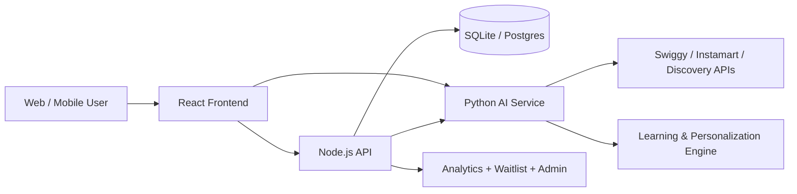

# MoodFood Architecture

## 1. Purpose and context

MoodFood is designed to answer a simple but high-value product question: “What should I eat right now?” It blends mood, budget, food preferences, and contextual signals to generate personalized meal suggestions, often through game-like experiences and a learning loop.

The repo currently implements a product with multiple surfaces:

- web app
- mobile app
- backend API
- AI recommendation service
- data persistence and personalization layer

## 2. System overview

## 3. Main architectural layers

### 3.1 Frontend layer

Location: [../apps/frontend](../apps/frontend)

Responsibilities:

- display marketing pages and app flows
- collect mood / quiz / game input
- trigger recommendation requests
- render results with explanations and alternatives
- allow user decision flows like swipe, spin, voting, quests, and group sessions

Key files:

- [../apps/frontend/src/App.tsx](../apps/frontend/src/App.tsx)
- [../apps/frontend/src/components](../apps/frontend/src/components)
- [../apps/frontend/src/services](../apps/frontend/src/services)
- [../apps/frontend/src/utils](../apps/frontend/src/utils)

Examples of feature modules:

- Hero, About, Contact, Waitlist
- GameSelector and multiple game components
- Recommendations and MindReader
- Quests and GroupSession
- MoodCheckIn and user decision flows

### 3.2 Backend API layer

Location: [../apps/backend](../apps/backend)

Responsibilities:

- session and auth handling
- API orchestration for web/mobile clients
- database access and persistence
- user profile and preference storage
- waitlist and analytics tracking
- Swiggy and Instamart request forwarding
- DIY cooking session management
- notifications and personalization signal storage

Key entrypoint:

- [../apps/backend/server.js](../apps/backend/server.js)

Notable components:

- [../apps/backend/routes](../apps/backend/routes)
- [../apps/backend/middleware](../apps/backend/middleware)
- [../apps/backend/lib](../apps/backend/lib)
- [../apps/backend/db.js](../apps/backend/db.js)

### 3.3 Intelligence layer

Location: [../apps/intelligence](../apps/intelligence)

Responsibilities:

- shortlist generation
- recommendation ranking
- learning from user behavior
- wildcard / anti-rut logic
- personalization modeling
- live restaurant and item enrichment
- recipe generation and moderation

Key entrypoint:

- [../apps/intelligence/app/main.py](../apps/intelligence/app/main.py)

Important directories:

- [../apps/intelligence/app/routes](../apps/intelligence/app/routes)
- [../apps/intelligence/app/services](../apps/intelligence/app/services)
- [../apps/intelligence/app/learning](../apps/intelligence/app/learning)
- [../apps/intelligence/app/schemas](../apps/intelligence/app/schemas)

### 3.4 Mobile app layer

Location: [../apps/mobile](../apps/mobile)

Responsibilities:

- same user journey adapted for mobile
- onboarding and login flows
- recommendation browsing
- profile, orders, notifications, and quests
- group/game experiences and restaurant menu details

This app mirrors the same product concept but is implemented as a native-like front-end experience.

## 4. Core business domains in the app

### 4.1 Recommendation domain

This is the core product domain.

Flow:

- collect user mood, budget, cravings, and context
- generate a candidate shortlist
- rank recommendations with AI
- attach explanations and alternatives
- optionally enrich with live Swiggy data

Relevant code:

- [../apps/frontend/src/services/aiRecommendations.ts](../apps/frontend/src/services/aiRecommendations.ts)
- [../apps/intelligence/app/routes/recommendations.py](../apps/intelligence/app/routes/recommendations.py)
- [../apps/intelligence/app/services/shortlist.py](../apps/intelligence/app/services/shortlist.py)

### 4.2 Personalization domain

The app learns from user interactions over time.

Signals include:

- mood check-ins
- swipes / vetoes / game results
- orders
- completed quests
- past preferences and context

Relevant code:

- [../apps/backend/routes/signals.js](../apps/backend/routes/signals.js)
- [../apps/backend/db.js](../apps/backend/db.js)
- [../apps/intelligence/app/learning](../apps/intelligence/app/learning)

### 4.3 Ordering and discovery domain

This domain integrates the food recommendation product with commerce and local discovery.

Relevant code:

- [../apps/backend/routes/swiggy.js](../apps/backend/routes/swiggy.js)
- [../apps/backend/routes/instamart.js](../apps/backend/routes/instamart.js)
- [../apps/intelligence/app/services/swiggy_discovery.py](../apps/intelligence/app/services/swiggy_discovery.py)
- [../apps/intelligence/app/services/instamart_discovery.py](../apps/intelligence/app/services/instamart_discovery.py)

### 4.4 Cooking and DIY domain

This is the “turn recommendation into a cooking action” layer.

Relevant code:

- [../apps/backend/routes/diy.js](../apps/backend/routes/diy.js)
- [../apps/intelligence/app/routes/recipe.py](../apps/intelligence/app/routes/recipe.py)
- [../apps/intelligence/app/services/recipe_generator.py](../apps/intelligence/app/services/recipe_generator.py)

### 4.5 Engagement and retention domain

Questing and streak logic are clearly designed to extend beyond first-order recommendations.

Relevant code:

- [../apps/backend/routes/quests.js](../apps/backend/routes/quests.js)
- [../apps/frontend/src/components/Quests.tsx](../apps/frontend/src/components/Quests.tsx)

## 5. Data model and persistence

The backend database setup in [../apps/backend/db.js](../apps/backend/db.js) shows a fairly rich user-centric model. Important tables include:

- users
- waitlist
- analytics_events
- quiz_completions
- signals
- taste_vector
- predictions
- mood_food_map
- user_preferences
- order_history
- notifications
- diy_sessions
- swiggy_user_tokens

This indicates the project is intentionally designed to support:

- identity and sessions
- personalization storage
- learned profile vectors
- recommendation calibration
- user action history
- grocery and recipe flows

## 6. Request flow

### Typical recommendation request

1. Web or mobile client builds a mood + context payload.
2. Frontend calls backend API through the service layer.
3. Backend adds session info, validation, and rate limiting.
4. Backend forwards the request to the Python AI service.
5. AI service does shortlist generation and ranking.
6. Optional live discovery is added via Swiggy / related APIs.
7. Response is returned to the client with metadata like confidence and prediction signals.

## 7. Architecture strengths

- Clear multi-layer separation between UI, API, and AI
- Strong personalization thinking through signal logging and learning
- Product breadth: recommendation, games, quests, ordering, cooking, and social decision flows
- Database design already supports user-level learning features
- Mobile app exists as a parallel product surface, not a separate disconnected prototype

## 8. Architectural notes and constraints

The repo is not a simple monolith. It is a multi-service product with several responsibilities that are intentionally separated but not fully standardized.

This means good onboarding requires understanding:

- which features live in the web app
- which are API-only versus AI-only
- which data is in the Node database vs the Python learning service
- where third-party discovery APIs are attached

## 9. Practical summary

MoodFood has a strong product concept and strong architecture intent, but it is still a product in active evolution. The system already contains the foundations of an AI-first food personalization platform, and its main technical shape is clear from the folder layout and service boundaries.
